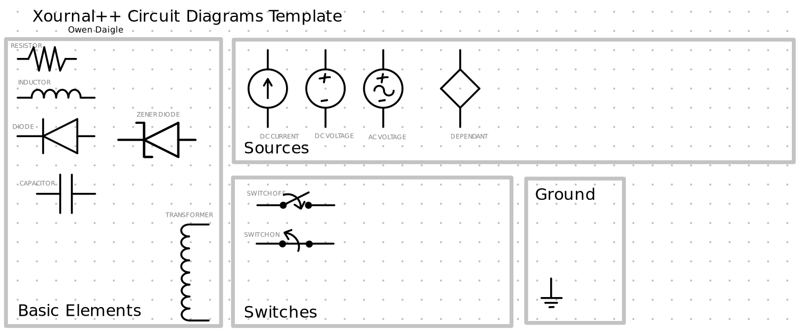

# Xournal++ Templates

Here are some templates that I have made and I use in xournal++

## Circuit Diagram Template

This is for basic circuit theory. It helps to make circuit diagrams in a simple way.

Made for the syntax preferences of uottawa's engineering department

Supports the following components:

- Resistors, Inductors, Capacitors, Diodes
- Sources (Independant current, DC/AC voltage, Dependant)
- Switches
- Ground
